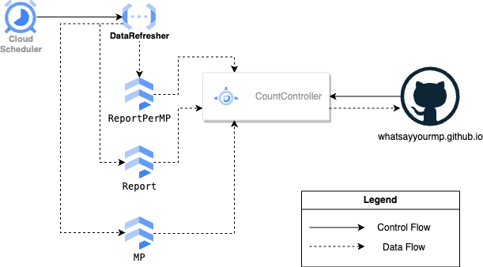

## What Say Your MP Backend

The backend has not been open-sourced yet because there are some privacy issues associated with doing so.
However, this section should at least give a high-level overview for readers to understand 'how the sausage is made'
so that they can be on the same page regarding discussions on the effort required for feature enhancements.

At a high level, the Data Refresher runs on a monthly cadence to refresh data from the [Singapore Parliament Hansards](https://sprs.parl.gov.sg/).
These data is then transformed & persisted into their respective Cloud Firestore tables.
The CountController is then responsible for performing on-the-fly tabulation of these counts.
Counts are precomputed and cached in the CountController at init time to minimize latency as well.

The CountController APIs and their interfaces can in turn be found in the corresponding [Axios service file](https://github.com/whatsayyourmp/whatsayyourmp.github.io/blob/main/src/app/services/index.ts).
